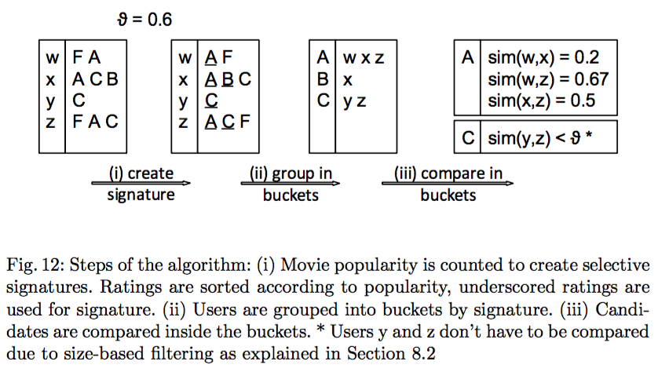
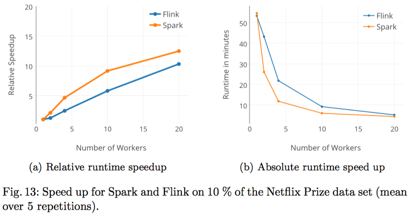

DATA CLEANSING
----
This application uses the Apache Spark/Flink Frameworks to find similar users in the Netflix user data set.
Users are compared based on the movies they rated, the rating value itself gets ignored.




The algorithm as well as results are discussed in Chapter 8 (p.20–24) of our technical report [Distributed Data Analysis with Apache Spark and Apache Flink](Distributed_Big_Data_Analytics.pdf).


BUILD
----
Use Java 7 and maven package

APACHE SPARK
----
Sample execution:
```
spark-submit --class de.hpi.fgis.willidennis.Main --master spark://172.16.21.111:7077  --conf spark.cores.max=10 scala/target/findSimilarNetflix-0.0.1-SNAPSHOT.jar --TRAINING_PATH training_set/
```

Program arguments:
* SIM_THRESHOLD: Threshold for Jaccard comparison; default: 0.9
* SIGNATURE_SIZE: number of movies used for signature; default: 1
* TRAINING_PATH: path to dataset
* OUTPUT_FILE: target path for output data
* EXECUTION_NAME: name this execution (Spark specific). Appears in the dashboard
* MEMORY: Memory to be used
* MASTER: Address of spark master node

APACHE FLINK
----
Sample execution:
```
flink run --class de.hpi.fgis.willidennis.Main target/findSimilarNetflix.jar --TRAINING_PATH training_set/by_user/ --SIGNATURE_SIZE 1 --FILES 1
```

Program arguments:
* SIM_THRESHOLD: Threshold for Jaccard comparison; default: 0.9
* SIGNATURE_SIZE: number of movies used for signature; default: 1
* TRAINING_PATH: path to dataset
* OUTPUT_FILE: target path for output data
* EXECUTION_NAME: name this execution (Spark specific). Appears in the dashboard

OUTPUT
----
Writes pairs of similar users (their user-ids) to OUTPUT_FILE.
